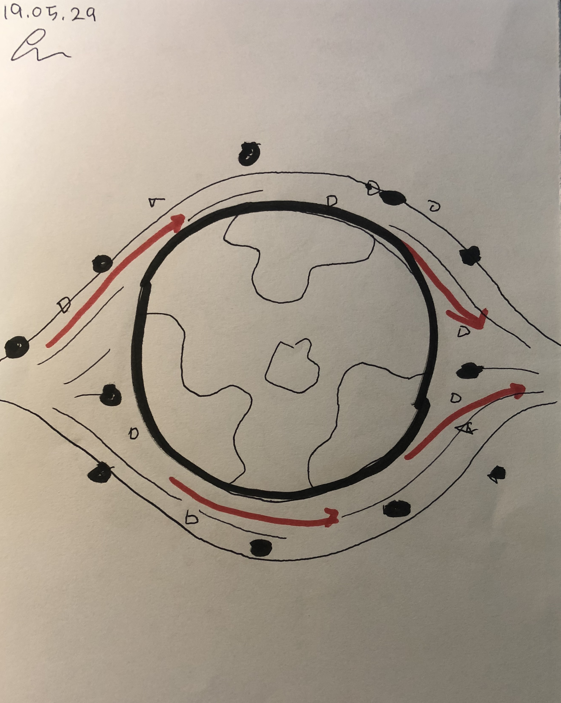
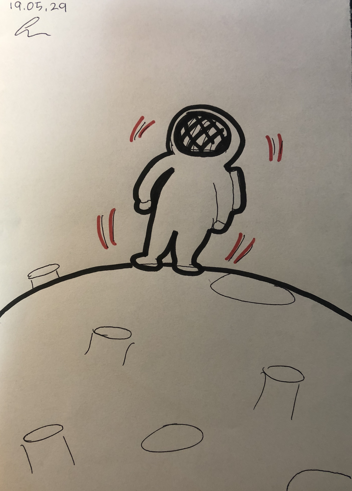

## WELCOME TO MY GitHub
 주소: <http://onghwang.github.io/PoeticCodeForNature/>
 * 저의 작품을 감상하실 수 있는 공간입니다.

## 작품 上
 * [RandomWalk](./RandomWalk/)
 * Universe  
 [First planet](./universe/1)  
 [Second planet](./universe/2)  
 [Third planet](./universe/3)  
 * ParticleSystem  
 [popcorn](./Particlesystem/1)  
 [Firework](./Particlesystem/2)

## 작품 下
 * [SolarSystem](./solarsystem/)
     
* [지구를 돌리는 우주비행사](./ast/)
 
 * [해바라기](./sunflower/)

